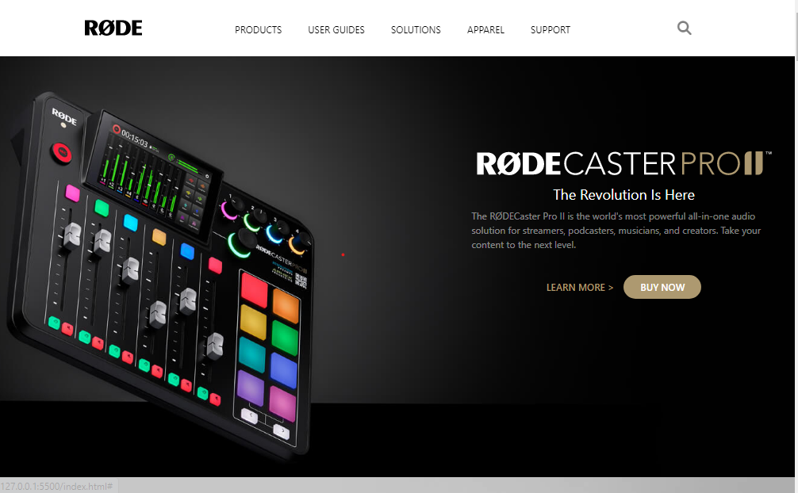

# FULL STACK JS Assignment

> In this project, I have used HTML (the Hypertext Markup Language) and Tailwind CSS, which are two of the core technologies for building Web pages. It is a responsive page.

[LIVE-LINK](https://samdish-rode-ui.netlify.app/)

#### The duration of the project:7 hour

#### Screenshot

